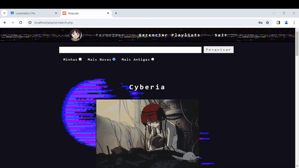

# Social Playlist

## About
    This project was a final project from programming lessons of a Senac course.

    The objective was to make a simple API in php using the knowledge of all the lessons about web programming with PHP, Javascript, Html and CSS.

    The subject i choose was a simple social network where you can upload photos texts and make a playlist with youtube or soundcloud links. Where users can express their feelings towards with poems or texts while linking their favourite songs. Or just store them in a easy way.

## ToDo
    The project was finished for that purpose but i want to improve it!! It needs:

    Better UI and UX;
    Pages in the search menus (it's important to make the site more functional);
    Page routes;
    Security revision;
    Code refactor;
    Better aesthetic;

## How to use
    It was made using xampp. So if you want to test it just install xampp and run the sql code in the script.sql of the database folder. It may be necessary to expand the memory usage in the xampp panel options.

    default admin login: admin 
    default admin password: admin123

## Project Structure
    The view's and controller's are in the root folder. The model's are in the repository folder.

    There are extra functions in the utils.

    The css, js and images are auto explanatory.

    User profile images are saved in base 64 in their profile databases.

    The rest of the content is all from other places of the internet for lower memory usage in the database.

## Project Functions Documentation (TODO in the next project version)
